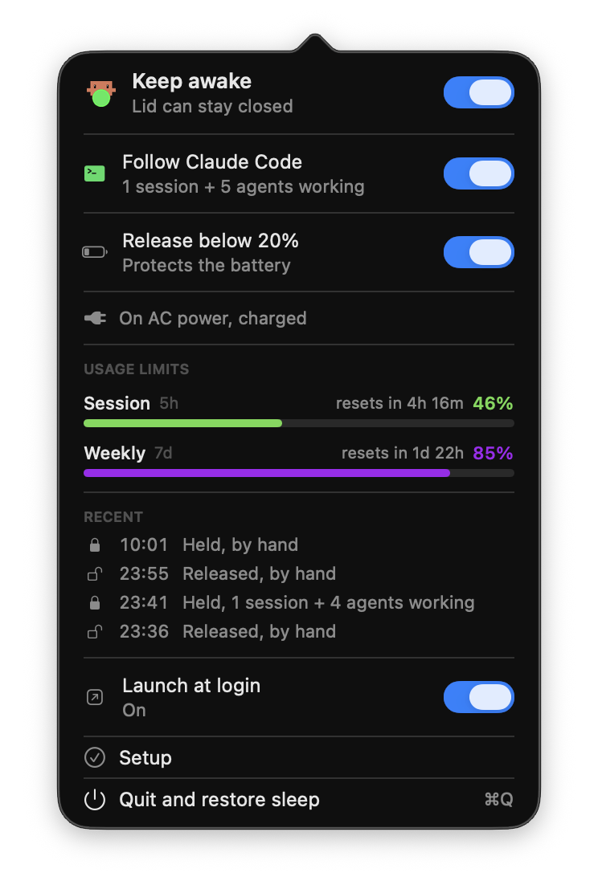

<div align="center">


# StayAwake

**Keep your Mac awake with the lid closed, automatically, only while Claude Code is actually working.**



</div>

## Why

Close the lid and your Mac sleeps, whatever it was in the middle of. `caffeinate`
does not help: it holds off *idle* sleep, but closing the lid overrides power
assertions. The only thing that works is `pmset disablesleep`, which needs root
and is easy to leave switched on by accident, quietly draining your battery for
days.

StayAwake drives that flag from the menu bar, and can drive it for you.

## Auto mode

Turn on **Follow Claude Code** and the Mac stays awake exactly while Claude Code
is working, then hands sleep back when it finishes.

A process check cannot do this. The `claude` process stays alive the whole time
a session sits idle at the prompt, so "running" and "working" are different
things. StayAwake installs Claude Code hooks instead:

| Event | Action | Meaning |
|---|---|---|
| `UserPromptSubmit` | acquire | a turn started |
| `SubagentStart` | acquire | background agent started |
| `PostToolUse` | acquire | still working, keeps the claim young |
| `Stop` | release | turn finished |
| `SubagentStop` | release | background agent finished |
| `SessionEnd` | release | session gone |

Each working session writes a claim file, and sleep is held while any claim
exists. Claims are counted, so several sessions overlap correctly, and
background subagents hold their own claim: a main-loop `Stop` cannot pull sleep
out from under an agent that is still running.

Sleep is handed back after **5 minutes of quiet**, not instantly. A turn ending
is not the same as you being done, and the grace covers the gap between turns so
a scheduled follow-up does not land on a sleeping machine.

An idle session deliberately holds nothing. A session waiting at the prompt is
finished, even though `claude` is still running.

## Install

Download the DMG from [Releases](../../releases), drag StayAwake to
Applications, and launch it.

First run opens a three-step setup:

1. **Allow sleep control.** One administrator prompt installs a sudoers rule
   granting exactly `pmset -a disablesleep 1` and `... 0` for your user, and
   nothing else. Without it, every change to the sleep flag would pop an
   authentication dialog, which makes auto mode unusable.
2. **Connect Claude Code.** Adds the six hooks above to
   `~/.claude/settings.json`. Your existing hooks are preserved; only entries
   mentioning `stayawake-claim` are touched, and the file is backed up first.
3. **Launch at login.** Without this the app stops after a restart and auto mode
   silently stops working, because the hooks keep writing claims that nobody
   reads.

Every step is idempotent and re-runnable from the panel.

## Safety

**Battery guard.** Below 20% on battery, StayAwake hands sleep back even if
Claude is working, and sleeps the Mac if the lid is shut. It outranks both auto
mode and a manual hold, because it is the one rule that protects the machine
from the app. Toggleable.

**Quit restores sleep.** Leaving the flag set is the failure this app exists to
prevent, so quitting turns it back off.

**Recent activity.** The panel lists the last hold, release and sleep events
with times and reasons, so "did it actually work while I was away?" is a glance
rather than an archaeology session in `pmset -g log`.

## Settings

```sh
defaults write cz.sebastiankucera.stayawake graceSeconds 120     # default 300
defaults write cz.sebastiankucera.stayawake batteryThreshold 30  # default 20
```

## Two things worth knowing

**While sleep is disabled, the Apple menu's Sleep item will not work either.**
The flag is system wide, not lid specific.

**Releasing the flag is not enough to put a lid-shut Mac to sleep.** Clamshell
sleep fires on the lid-close *event*; clearing `disablesleep` afterwards never
replays it, and idle sleep does not cover it because browsers, `coreaudiod` and
`caffeinate` routinely hold idle-sleep assertions. So when auto mode releases
with the lid shut, StayAwake also calls `pmset sleepnow`. It skips that when an
external display is attached, since a shut lid plus a monitor means the machine
is in use.

This one was found the hard way: a lid closed with a session working, the
session died at 14:11, the flag correctly released at 14:16, and the Mac then
sat awake on battery until 16:32, draining 50% to 35%. The release worked.
Nothing turned it into actual sleep.

## Build from source

```sh
./tools/install.sh     # build, install to /Applications, relaunch
./build.sh             # build in place only
./tools/make-dmg.sh    # package, sign and notarise a release
```

`build.sh` signs with a Developer ID Application certificate when one is in the
keychain, applying the hardened runtime and a secure timestamp, and falls back
to ad-hoc otherwise. Releasing needs notarisation credentials stored once:

```sh
xcrun notarytool store-credentials notary \
  --apple-id <apple-id> --team-id <team-id> --password <app-specific-password>
```

No Xcode project: a handful of Swift files compiled with `swiftc` into a bundle.

| File | Purpose |
|---|---|
| `StayAwake.swift` | app entry, `MenuBarExtra` |
| `Panel.swift` | the dropdown panel |
| `SetupView.swift` | onboarding window |
| `Setup.swift` | sudoers rule and hook installation |
| `Icon.swift` | menu bar art loading |
| `Power.swift` | `pmset` state, auto mode, battery guard |
| `Claims.swift` | claim store shared by app and hook helper |
| `ClaimTool.swift` | `stayawake-claim`, invoked by hooks |
| `Activity.swift` | the recent-events log |
| `Login.swift` | login item registration |

### The artwork

Masters live in `Assets/source/`. After editing either state:

```sh
python3 tools/make-icons.py && ./build.sh
```

The generator does two things that are easy to miss. The sleeping master is an
opaque white body, invisible on a light menu bar, so it is converted to a
template mask and tinted by macOS. And art is placed by its **optical** centre,
not its bounding box: the creature's head is dense while its legs are thin
outlines, so a geometrically centred icon carries its weight high and visibly
sits above its neighbours.

### Testing

`STAYAWAKE_CLAUDE_DIR` points the hook writing at a scratch copy of
`settings.json` instead of your live one.

## License

MIT
